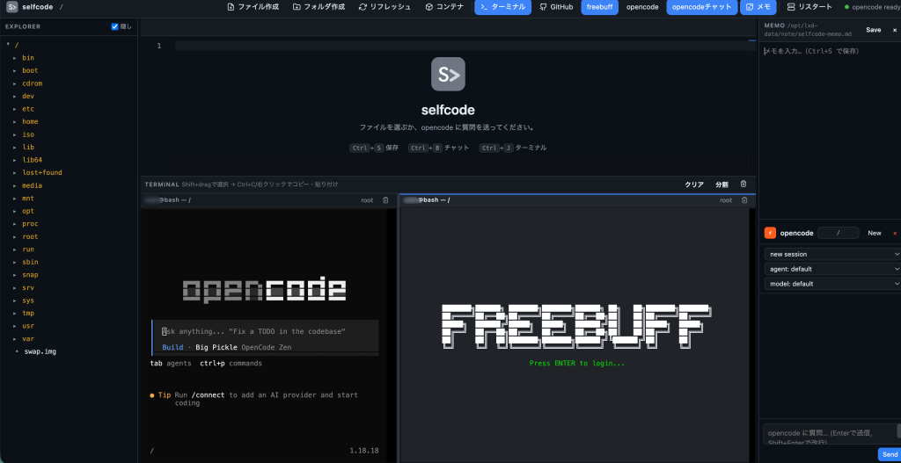
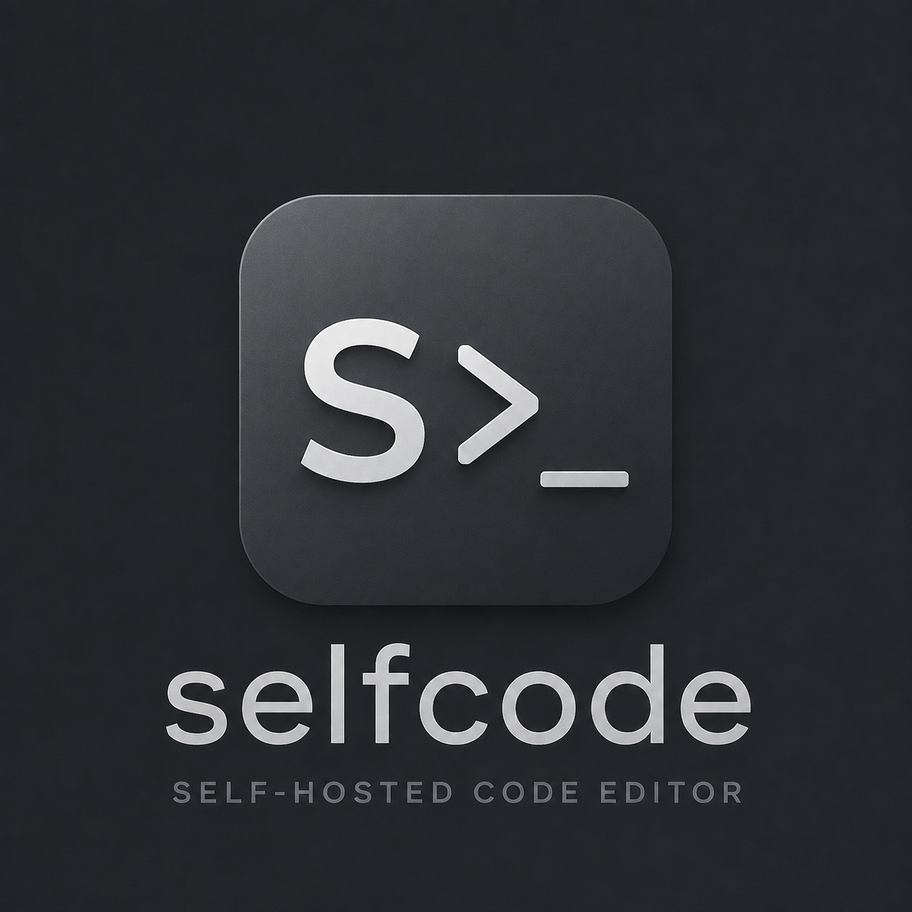

# selfcode

code-server のようにブラウザから使えて、opencodeやFreebuff、Google Antigravityとの連携機能やGitHubとの連携機能がある、セルフホスト型コードエディタです。

- Monaco エディタ（VS Code と同じエディタエンジン）
- ファイルツリー / タブ編集 / 保存（Ctrl+S）
- xterm.js ターミナル（**分割**・**ユーザー切替**・**リフレッシュ**対応）
- opencode チャットパネル（AI がワークスペース内のファイルを直接編集）
- **opencode / freebuff / agy (Antigravity CLI)** ボタンでターミナルを分割して CLI を起動（未インストールなら確認して自動インストール）
- **一時SSH** ボタンで、agy などの OAuth 認証を手元 PC から行えるよう SSH のパスワード認証・root ログインを一時的に有効化（もう一度押すと解除）
- **LXD / Docker コンテナ連携**（コンテナ内のファイル操作・ターミナル）
- **GitHub 連携**（ユーザー名・トークンの保存、リポジトリのクローン登録、status / fetch / pull / ログ表示）
- opencode サーバーはバックエンドが自動起動し、`/opencode/*` でプロキシ（認証情報はブラウザに触れない）
- **Tailscale serve** で Tailnet 内のみに HTTPS 公開が可能（LAN 非公開）



## インストール（GitHub から）

[GitHub リポジトリ](https://github.com/hirogura/selfcode) から、別の環境にもインストールできます。

### 自動インストール（推奨）

```bash
sudo apt install -y git curl nodejs npm
curl -fsSL https://raw.githubusercontent.com/hirogura/selfcode/main/install-selfcode.sh -o /tmp/install-selfcode.sh
sudo bash /tmp/install-selfcode.sh
```

- 既定のインストール先は `/opt/lxd-data/selfcode`（第1引数で変更可: `sudo bash install-selfcode.sh /srv/selfcode`）
- `opencode` / `freebuff` / Antigravity CLI (`agy`) が未導入の場合は、確認のうえ一緒にインストールします（Enter または `y` で進む）
- systemd サービス `selfcode.service` の登録・自動起動も行います
- **Tailscale を導入済みなら、確認のうえ `tailscale serve` で Tailnet 内のみに公開**します（完了メッセージにアクセス URL を表示）
- 確認をすべてスキップするには `-y` を付けて実行: `sudo bash install-selfcode.sh -y`

### 手動インストール

```bash
sudo mkdir -p /opt/lxd-data/selfcode
sudo git clone https://github.com/hirogura/selfcode.git /opt/lxd-data/selfcode
cd /opt/lxd-data/selfcode
sudo npm install
```

必要な CLI（未導入の場合。ターミナルから起動する際に確認プロンプトでインストールすることもできます）:

```bash
# opencode（公式インストーラ。~/.opencode/bin/opencode に導入される）
curl -fsSL https://opencode.ai/install | bash

# freebuff（npm グローバル）
sudo npm install -g freebuff

# Antigravity CLI（公式インストーラ。~/.local/bin/agy に導入される）
curl -fsSL https://antigravity.google/cli/install.sh | bash
```

## 起動

```bash
cd /opt/lxd-data/selfcode
npm install
PORT=3339 npm start
```

ブラウザで http://localhost:3339 を開きます。

## 環境変数

| 変数 | デフォルト | 説明 |
| --- | --- | --- |
| `PORT` | `3339` | selfcode の待受ポート |
| `HOST` | `127.0.0.1` | 待受ホスト（**LAN 非公開**。Tailscale serve で公開する想定） |
| `ROOT` | `/` | 編集対象ディレクトリ（例: `ROOT=/home/user/myproject`） |
| `SELFCODE_USERNAME` / `SELFCODE_PASSWORD` | なし | 設定すると selfcode 自体に Basic 認証を付与 |
| `SELFCODE_TERM_USER` | 自動検出 | ホスト側ターミナルの既定ユーザー（例: `user`。未指定なら uid 1000 以上の実ユーザーを検出） |
| `SELFCODE_MEMO` | `/opt/lxd-data/note/selfcode/selfcode-memo.md` | メモパネルの保存先 |
| `SELFCODE_GITHUB_CONFIG` | `/opt/lxd-data/note/selfcode/selfcode-github.json` | GitHub 連携の設定保存先（ユーザー名・トークン・登録リポジトリ。トークンはブラウザに返さずサーバー側でのみ使用） |
| `SELFCODE_TERM_STATE` | `/opt/lxd-data/note/selfcode/selfcode-term.json` | ターミナルのペイン構成（分割・cwd・id）の保存先。別のPCから同じ selfcode を開いても同じターミナルプロセスに再接続するために使う |
| `SELFCODE_CHAT_STATE` | `/opt/lxd-data/note/selfcode/selfcode-chat.json` | チャットで選択中の opencode セッションとワークスペースの保存先 |
| `SELFCODE_RESTART_CMD` | `systemctl restart selfcode` | 「リスタート」ボタンが実行するコマンド |
| `OPENCODE_SERVER_USERNAME` / `OPENCODE_SERVER_PASSWORD` | `opencode` / 自動生成 | opencode サーバーの認証 |
| `OPENCODE_BIN` | `opencode` | opencode バイナリのパス |

## systemd で常駐させる

1. ユニットファイルをインストール:
   ```bash
   sudo cp selfcode.service /etc/systemd/system/
   sudo systemctl daemon-reload
   ```
2. 必要に応じて `/etc/systemd/system/selfcode.service` の `Environment=` を編集
3. 起動:
   ```bash
   sudo systemctl enable --now selfcode
   ```

ログは `journalctl -u selfcode -f` で確認できます。

## Tailscale serve で公開（Tailnet 内のみ）

Tailscale を導入済みのマシンなら、selfcode を **Tailnet 内のみ**に HTTPS 公開できます（LAN には公開されません）。

```bash
# selfcode は既定で localhost のみ待受（HOST=127.0.0.1）
# ポート 3339 を Tailnet に HTTPS 公開する
# フォアグラウンドで実行されると Ctrl+C で解除されるため --bg を付ける
sudo tailscale serve --bg --https=3339 http://127.0.0.1:3339
```

- 公開後は **https://<マシンのtailnet名>:3339**（例: `https://hostname.tailnet名.ts.net:3339`）でアクセスできます
- 現在の設定確認: `tailscale serve status`
- 公開の取り消し: `sudo tailscale serve --https=3339 off`
- 証明書は Tailscale が自動発行します。`http://` でのアクセスは HTTPS サーバーが 400 を返すため、**必ず `https://` を使用**してください
- インストールスクリプトでも、Tailscale 導入済みなら確認のうえ自動設定できます

## 使い方

- 左の EXPLORER からファイルを開き、`Ctrl+S` で保存
- 右下の **opencodeチャット**（Ctrl+B）に自然言語で指示 → AI がワークスペース内のファイルを直接変更
- 変更されたファイルはエディタのタブに自動反映（未保存のタブは上書きしません）
- opencode が権限を求めたら Allow / Deny で応答
- 右上の **opencode** ボタン / **freebuff** ボタン / **agy** ボタン（Antigravity CLI）で、**ターミナルを分割**して新しいペインで各 CLI を起動
  - CLI が未インストールの場合は `[Y/n]` で確認（Enter または `y` で自動インストールして起動）
- 右上の **一時SSH** ボタンで、agy などの OAuth 認証を手元 PC から行えるようにする（トグル）
  - **ON**: 選択中の LXD コンテナ（未選択ならホスト）の root パスワードを `selfcode` に設定し、SSH のパスワード認証・root ログインを有効化して sshd を再起動
  - openssh-server が未導入の場合は確認を表示し、`y` で apt から自動インストールしてから有効化
  - 手元 PC から `ssh -L <ポート>:localhost:<ポート> root@<IP>` でコンテナへポートを転送し、接続したら `agy` と入力して認証 URL を確認、手元 PC のブラウザで認証（Tailscale 利用時はマジックDNS名 `root@<ホスト名>` でも接続可能。手順は ON 時にターミナルへ案内表示）
  - 認証完了後、もう一度ボタンを押して **OFF** にすると、バックアップした sshd 設定と root パスワードを復元
- EXPLORER のフォルダ（またはファイル）を右クリック → **ここで freebuff** で、そのフォルダをワークスペースとして freebuff を起動
- 下の **ターミナル**（Ctrl+J）で `opencode` CLI などを実行
  - **分割**ボタンでペインを分割（フォーカス中のターミナルのフォルダを引き継ぐ）
  - 各ペインの見出しで **ユーザー切替**（root ⇔ 一般ユーザー）・**ゴミ箱**（リセットしてルートへ）・**×**（閉じる）
  - ツールバーの**ゴミ箱**でターミナル全体をリフレッシュ（全分割を解除して初期状態に戻す）
  - ターミナルのペイン構成（分割・cwd・id）はサーバー側にも保存されるため、**別のPCから同じ selfcode を開いても同じターミナルセッションに再接続**できます（code-server と同様に、そのまま作業の続きが見えます）
- opencode チャットで開いている **セッション・ワークスペースもサーバー側に保存**され、別のPCから開いたときに最後に使っていたセッションを自動的に開きます
- ツールバーの **コンテナ** ボタンで LXD / Docker の稼働中コンテナを選択
  - エクスプローラがコンテナ内の `/` をルートに切り替わり、ファイルの閲覧・編集・アップロードが可能
  - ターミナルもコンテナ内で開きます（コンテナ内のユーザー・シェルで起動）
  - **ホストに戻る**で通常のワークスペースに戻ります
- ツールバーの **メモ** ボタンでメモパネルを開閉（Ctrl+S で保存）
- ツールバーの **GitHub** ボタンで GitHub パネルを開閉
  - **設定** に GitHub ユーザー名と Personal Access Token を入力して **保存**（トークンはサーバー側のファイルに保存され、ブラウザには返りません。**接続確認** でトークンの有効性を確認できます）
  - **＋ 追加** からリポジトリを **クローン** して登録（URL または `owner/repo` 形式。**自分のリポジトリから選ぶ** で一覧から選択も可能）
  - 既存フォルダ（git リポジトリ）もパスを入力して **登録** できます
  - 登録したリポジトリごとに **状態**（ブランチ・ahead/behind・変更数）、**取得**（fetch）、**pull**、**ログ**、**開く**（GitHub ページ）が使えます
  - 登録解除（×）は登録情報だけを削除し、ローカルのファイルは削除しません

## 構成

```
server.js          Node.js バックエンド（静的配信 / ファイルAPI / ターミナルWS / opencodeプロキシ / コンテナ連携）
public/            フロントエンド（Monaco + xterm.js + チャットUI + ツールバー）
install-selfcode.sh インストールスクリプト（GitHub から取得して導入・Tailscale serve 設定）
selfcode.service   systemd ユニットファイル（HOST=127.0.0.1 で LAN 非公開）
```

## アンインストール

```bash
# 1. systemd サービスを停止・削除
sudo systemctl stop selfcode
sudo systemctl disable selfcode
sudo rm /etc/systemd/system/selfcode.service
sudo systemctl daemon-reload

# 2. Tailscale serve の公開を停止（設定していれば）
sudo tailscale serve --https=3339 off

# 3. インストール先を削除（保存したいデータは先に退避してください）
sudo rm -rf /opt/lxd-data/selfcode

# 4. 一緒にインストールした CLI も不要なら削除
rm -rf ~/.opencode            # opencode（~/.opencode/bin/opencode）
sudo npm uninstall -g freebuff
rm -f ~/.local/bin/agy         # Antigravity CLI (agy)
```

## 補足

- opencode のモデル設定・プロバイダ認証はホスト側の `~/.config/opencode/` を使います。
- opencode サーバーは 127.0.0.1 の一時ポートで起動し、外部には公開しません。
- 認証情報やデータベースなどの個人情報は `.gitignore` でリポジトリから除外されています。



## ライセンス

本プロジェクトは **MIT License** で公開されています。詳細は [LICENSE](LICENSE) を参照してください。

```
MIT License

Copyright (c) 2026 hirogura

Permission is hereby granted, free of charge, to any person obtaining a copy
of this software and associated documentation files (the "Software"), to deal
in the Software without restriction, including without limitation the rights
to use, copy, modify, merge, publish, distribute, sublicense, and/or sell
copies of the Software, and to permit persons to whom the Software is
furnished to do so, subject to the following conditions:

The above copyright notice and this permission notice shall be included in all
copies or substantial portions of the Software.

THE SOFTWARE IS PROVIDED "AS IS", WITHOUT WARRANTY OF ANY KIND, EXPRESS OR
IMPLIED, INCLUDING BUT NOT LIMITED TO THE WARRANTIES OF MERCHANTABILITY,
FITNESS FOR A PARTICULAR PURPOSE AND NONINFRINGEMENT. IN NO EVENT SHALL THE
AUTHORS OR COPYRIGHT HOLDERS BE LIABLE FOR ANY CLAIM, DAMAGES OR OTHER
LIABILITY, WHETHER IN AN ACTION OF CONTRACT, TORT OR OTHERWISE, ARISING FROM,
OUT OF OR IN CONNECTION WITH THE SOFTWARE OR THE USE OR OTHER DEALINGS IN THE
SOFTWARE.
```
